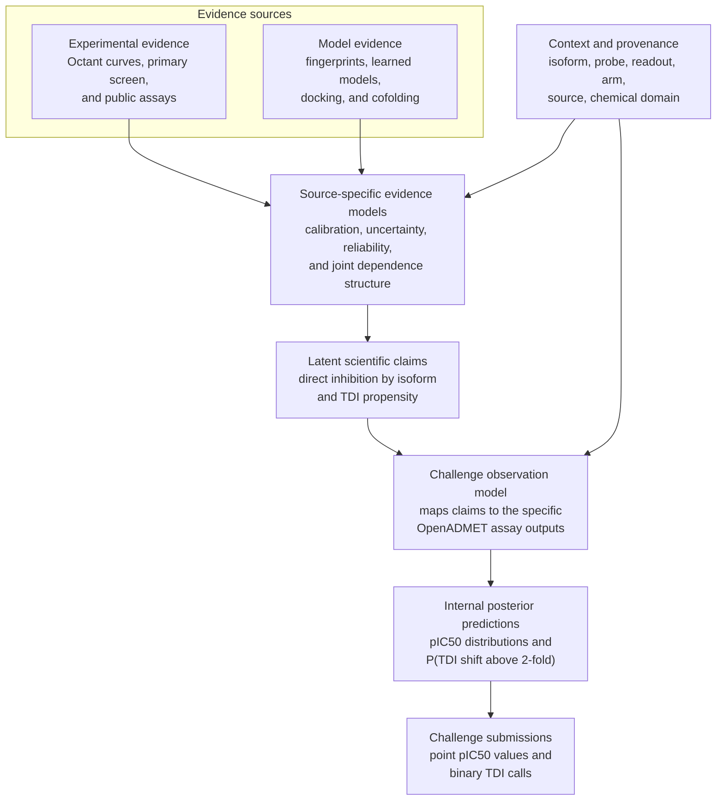

# OpenADMET CYP challenge - A Bayesian claim-evidence framework approach.

Daniel Saltzberg - @dargason
Version 0.1, 2026-08-10

## What is this?

The biological endpoints that we wish to predict in drug development (inhibition in cells, induction of PXR, efficacy in humans) are rarely directly observable in a single assay.  Rather, each data point provides incomplete and differentially biased evidence towards each endpoint - and our job is to compile multiple pieces of heterogeneous evidence together and determine the likelihood of an outcome for those endpoints.  So rather than treat each piece of data as ground truth, I propose to combine these heterogeneous sources of data through a Bayesian claim-evidence framework and learn how reliable each source of data is to each endpoint.

For the CYP challenge, our goal is to model two endpoints: inhibition and time-dependent-inhibition (TDI).  The input data used to inform these endpoints include the Octant-supplied experimental measurements, plus computed fingerprints and properties, outside data, and other information; these all enter as distinct evidence sources, with their uncertainty, assay context, and shared dependencies explicitly represented.  The resulting system will produce calibrated beliefs about each of the two endpoints and provides a prospective test of the broader idea: does explicitly modeling what each piece of information tells us and how much we trust it give better and more robust scientific prediction than conventional pooling or model ensembling.

The [OpenADMET CYP challenge](https://openadmet.ghost.io/announcing-openadmets-cyp-inhibition-blind-challenge/) is a great sandbox to test these ideas and build this framework.

## The Bayesian claim-evidence framework

I am using *evidence* in a specific sense. A claim is something we want to know but cannot observe directly. Evidence is an assay result or model output that changes our belief in that claim. Context tells us what kind of evidence it is and where it came from.

For this challenge, the claims are direct inhibition of each CYP isoform and the propensity for time-dependent inhibition (TDI). Evidence can come from an Octant curve, a public assay, a molecular model, docking, or cofolding. The context includes the isoform, probe, readout, preincubation arm, source, and chemical domain. None of those evidence sources is declared to be ground truth.

In shorthand, let `C` be the claims, `E` the available evidence, and `X` the context:

`p(C | E, X) ∝ p(C | X) p(E | C, X)`

The equation is the easy part. Most of the work is in `p(E | C, X)`: what would I expect this source to report if a claim were true, and how much variation or bias should I expect? A resolved twelve-point curve may give fairly narrow evidence about an assay-specific pIC50. A censored curve may give only a bound. A measurement made with another probe may still help, but it may be shifted. Docking or cofolding may support a mechanistic explanation without directly measuring inhibition.

Different representations of one assay record are not separate evidence. The raw curve, fitted pIC50, censoring bound, and any TDI label derived from the matched curves belong to one evidence family. They retain a shared source-record identity and enter through one observation model, rather than contributing independent likelihood terms.

Dependence between sources matters. Two predictors trained on the same records are not two independent experiments. Morgan fingerprints, ChemProp, and Uni-Mol all start from the same molecular structure. Docking and cofolding may share receptor structures or scoring assumptions. The model must represent these relationships through joint or hierarchical evidence terms. Drawing the relationships in a graph is not enough; the dependence model is what prevents repeated information from being treated as independent support.

The challenge adds an observation layer between the scientific claim and the submitted prediction. It asks for an apparent pIC50 in a particular assay, not a universal Ki or binding affinity. Internally, the framework produces a posterior predictive distribution for that assay, conditional on its probe, readout, isoform, and preincubation arm. A prespecified decision rule reduces that distribution to the scalar pIC50 required for submission.

TDI is handled in the same framework, but the latent claim and the challenge label remain distinct. The claim is a compound's propensity for time-dependent inhibition. The operational challenge observation is `IC50(-NADPH) / IC50(+NADPH) > 2`. Equivalently, define the matched-arm shift as `ΔpIC50 = pIC50(+NADPH) - pIC50(-NADPH)`; the label is positive when `ΔpIC50 > log10(2)`, or about 0.301. When the curve evidence allows it, the model estimates the probability of crossing that threshold and maps it to the required binary output.

There is also a proposed division of labor between the human and the learning system. At minimum, the human names the claim and supplies assay context and source provenance. The learning system then tries to infer how informative, biased, and reliable each source is, including dependencies that can be learned from shared provenance and data. Known experimental dependencies can still be declared rather than rediscovered. One question for this work is how little structure the human can provide without making the evidence model uninterpretable.

The challenge directly tests the quality of the submitted CYP predictions. It does not, by itself, establish that the posterior is calibrated, that source reliabilities are correct, or that the evidence attribution is causal. Those are separate diagnostics of the framework. The broader question is whether the framework can improve challenge performance while also producing a useful account of why a belief changed: which evidence moved it, in which direction, and with how much support.

## Prior art and related approaches

I have not found a single published CYP model that matches this framework end to end. The closest work covers four overlapping pieces: Bayesian data fusion, learning source reliability, modeling heterogeneous assays, and CYP-specific prediction.

### Bayesian evidence fusion and source reliability

**BANDIT** is the closest drug-discovery precedent for the overall idea. It uses a Bayesian model to combine several kinds of evidence about a drug and produce a posterior distribution over possible targets.[1] The endpoint is target identity rather than CYP inhibition, but the separation between evidence type and latent claim is directly relevant.

The broader **Bayesian evidence-synthesis** literature is an even closer conceptual ancestor. Turner and colleagues model differences in study rigor and relevance as source-specific bias.[14] Presanis and colleagues represent disparate, dependent evidence in a directed acyclic graph and test where sources conflict.[16] In pharmacology, **E-Synthesis** combines heterogeneous pharmacovigilance evidence and uses “evidential modulators” to represent reliability.[15] These systems infer different claims, but they address the same basic problem: evidence sources can vary in bias, relevance, dependence, and agreement.

The **Dawid-Skene** model estimates an unobserved label together with the error rates of multiple observers.[2] **Snorkel** extends this general weak-supervision idea to programmatic labeling sources and models their accuracy and dependence.[3] Assays and molecular models are not human annotators, but the analogy is useful: each source is fallible, several sources can share errors, and agreement is not enough if the sources are dependent.

**Bayesian calibration of computer models** separates observations, simulator output, parameter uncertainty, and model discrepancy.[4] That is a useful precedent for treating docking or cofolding as imperfect computational evidence rather than as another experimental measurement.

The **Open Targets Platform** is a practical evidence framework rather than a Bayesian model. It combines multiple evidence classes to support target-disease hypotheses and keeps their provenance visible.[9] It is relevant to the representation and audit trail, although its evidence aggregation is not the learned likelihood model proposed here.

### Heterogeneous bioactivity models

**Macau** applies Bayesian matrix factorization to sparse response matrices while incorporating high-dimensional side information.[5] It is a close statistical precedent for a sparse compound-by-assay matrix with molecular features, but it does not provide the full claim-observation structure proposed here.

**pQSAR** learns across thousands of assays by using predictions from many single-assay models as an activity profile.[6] It demonstrates how much information can be shared across a large assay collection. Its profile predictions are features, however, rather than evidence sources with explicit reliability and dependence models.

Chan and colleagues used **neural processes** to model heterogeneous assays hierarchically instead of pooling them as if they measured one interchangeable endpoint.[7] Recent work on **assay-aware bioactivity modeling** also argues that probe, readout, format, and other assay metadata should be represented explicitly.[13] These are especially close to the observation-model part of this proposal.

Work on **molecular uncertainty quantification** provides methods and evaluation criteria for predictive uncertainty, but also shows that no single uncertainty estimator works best in every setting.[8] **Multi-fidelity molecular learning** provides another relevant comparison: low-cost computational or experimental measurements can inform a scarce high-fidelity endpoint without being treated as equivalent measurements.[12]

### CYP-specific precedents

**CYPlebrity** combines several public and proprietary sources to train machine-learning classifiers for inhibition of the five major CYP isoforms.[10] It is a direct endpoint precedent and a useful conventional comparator, but it resolves source differences during data assembly rather than learning an explicit evidence model.

Faramarzi and colleagues developed QSAR models for both reversible CYP inhibition and time-dependent inhibition, including CYP3A4 TDI.[11] This is the closest endpoint-specific precedent for treating direct inhibition and TDI together. It still treats the curated assay outcomes as model targets rather than as observations generated from a latent claim.

Taken together, this work suggests that the individual parts are established, but their combination is less explored. The proposed framework combines: (1) a latent scientific claim, (2) assay-specific observation models, (3) learned source reliability and dependence, and (4) an explicit mapping from posterior beliefs to the scalar and binary outputs required by the challenge. The comparison should therefore be against these component approaches, not against a claim that Bayesian evidence integration itself is new.

## The assay and data problem

Assays are never as clean as you would hope and assays across systems are never as matched as one would like.  This problem exists in the CYP challenge.  The challenge contains direct-inhibition endpoints for four CYP isoforms: CYP3A4, CYP2C9, CYP2D6, and CYP1A2. These are recombinant-enzyme biochemical assays, not cell assays.

The CYP3A4, CYP2C9, and CYP1A2 fluorescence assays are adapted from ThermoFisher Vivid kits. CYP3A4 uses DBOMF; CYP2C9 and CYP1A2 use EOMCC. CYP2D6 instead measures dextromethorphan parent depletion by acoustic ejection mass spectrometry; the tested fluorescent probes did not perform adequately. Probe and readout therefore need to be represented explicitly rather than hidden inside the isoform label.  How much can we trust the data that comes from each experiment to correctly represent the ground-truth inhibition of these compounds?

Each dose-response experiment has matched preincubation arms. The direct arm omits NADPH. The time-dependent inhibition (TDI) arm includes NADPH and can capture metabolism-dependent inhibition in addition to direct inhibition. These pIC50 values are apparent, probe-dependent assay outcomes, not Ki's or binding affinities. T

Additionally, there is a large single-concentration screen in the active-preincubation condition, plus about 1,500 twelve-point curves per isoform. The training dose-response matrix is sparse across isoforms. The test matrix is dense: 750 compounds measured against all four CYPs.

The test chemistry is not a random sample. Potent CYP1A2, CYP2C9, and CYP3A4 hits were expanded with close Enamine chemisimilars. CYP2D6 seeded no series. Half of the test set is used for the live leaderboard, with the split made by chemisimilar series. Full-test performance is scheduled to be shown once at the intermediate deadline.

For direct inhibition, the metric is slightly different than for the PXR challenge.  To account for high uncertainty in very weak-binding compounds, a modified macro-averaged Soft-Threshold Relative Absolute Error (MA-ST-RAE) is employed. A prediction inside the fitted credible interval has zero error. Outside it, error is measured to the nearest bound.

TDI is scored for CYP3A4 and CYP2D6 by Matthews correlation coefficient (MCC). The target is an IC50 shift greater than two-fold. A label may be measured from two resolved curves, inferred from assay limits, or assigned from those limits. Only confidently assigned labels are scored.

## Claims and comparisons

The primary hypothesis is that a shared, uncertainty-aware model improves series-held-out MA-ST-RAE over the same molecular model trained on point pIC50 values.

There are four secondary questions.

- Does sharing information across isoforms help?
- Does the large active-preincubation screen help as an auxiliary task, or does its TDI-specific selection bias hurt transfer?
- Does a joint representation of the matched arms improve TDI prediction over hard-label classification?
- Do structural features add information beyond chemistry, especially outside familiar chemical neighborhoods?

## Sources

[1] https://doi.org/10.1038/s41467-019-12928-6 — A Bayesian machine learning approach for drug target identification using diverse data types
[2] https://doi.org/10.2307/2346806 — Maximum Likelihood Estimation of Observer Error-Rates Using the EM Algorithm
[3] https://doi.org/10.1007/s00778-019-00552-1 — Snorkel: rapid training data creation with weak supervision
[4] https://doi.org/10.1111/1467-9868.00294 — Bayesian Calibration of Computer Models
[5] https://doi.org/10.1109/MLSP.2017.8168143 — Macau: Scalable Bayesian factorization with high-dimensional side information using MCMC
[6] https://doi.org/10.1021/acs.jcim.9b00375 — All-Assay-Max2 pQSAR
[7] https://doi.org/10.48550/arXiv.2308.09086 — Embracing assay heterogeneity with neural processes for markedly improved bioactivity predictions
[8] https://doi.org/10.1021/acs.jcim.0c00502 — Uncertainty Quantification Using Neural Networks for Molecular Property Prediction
[9] https://doi.org/10.1093/nar/gkaa1027 — Open Targets Platform: supporting systematic drug-target identification and prioritisation
[10] https://doi.org/10.1016/j.bmc.2021.116388 — CYPlebrity
[11] https://doi.org/10.3389/fphar.2024.1451164 — Novel QSAR models for prediction of reversible and time-dependent inhibition of CYP enzymes
[12] https://doi.org/10.1038/s41467-024-45566-8 — Transfer learning with graph neural networks for improved molecular property prediction in the multi-fidelity setting
[13] https://doi.org/10.1021/acs.jcim.5c00603 — Toward Assay-Aware Bioactivity Model(er)s: Getting a Grip on Biological Context
[14] https://doi.org/10.1111/j.1467-985X.2008.00547.x — Bias Modelling in Evidence Synthesis
[15] https://doi.org/10.3389/fphar.2019.01317 — E-Synthesis: A Bayesian Framework for Causal Assessment in Pharmacosurveillance
[16] https://doi.org/10.1214/13-STS426 — Conflict Diagnostics in Directed Acyclic Graphs, with Applications in Bayesian Evidence Synthesis
