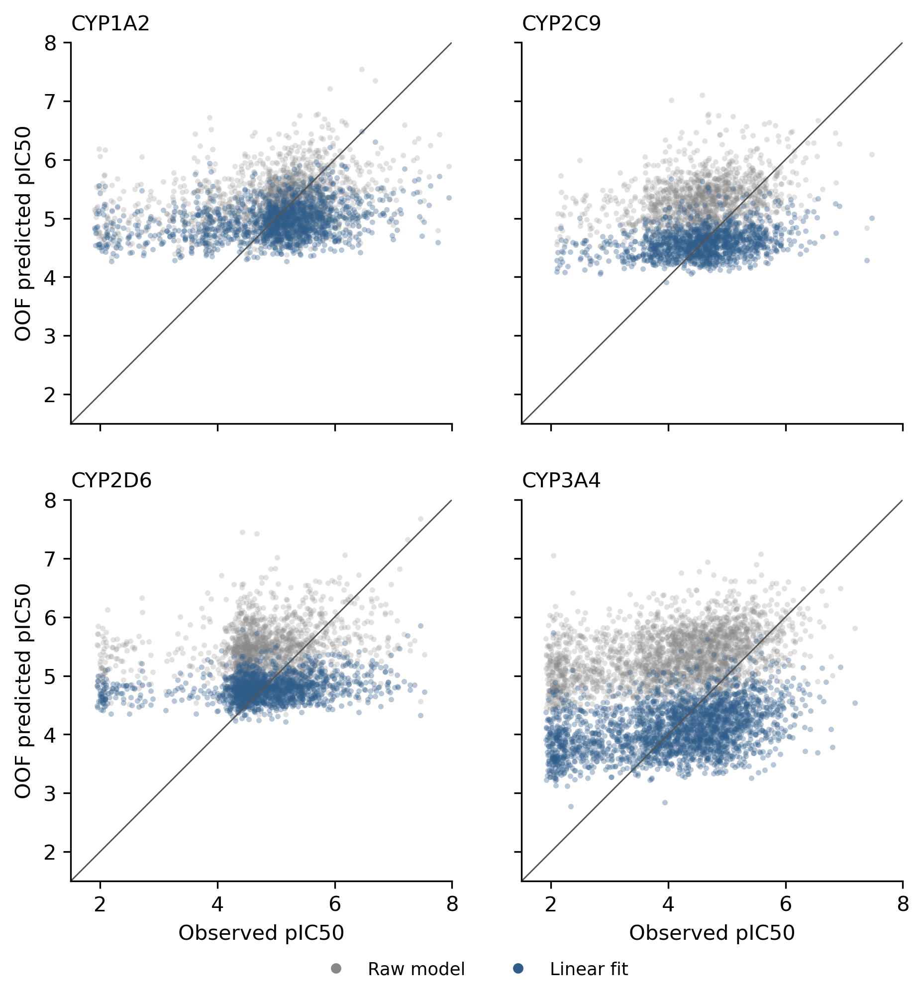

# 002-OADMET-CYP-chemeleon_linear-fit

This submission applies an endpoint-specific linear calibration to predictions from the pretrained [OpenADMET ChEMBL 37 CYP CheMeleon model](https://huggingface.co/openadmet/cyp1a2-cyp2d6-cyp3a4-cyp2c9-chemeleon-v1).  

## Model

**Information Flow Summary**:
```text
challenge SMILES
→ Pretrained OpenADMET CYP-finetuned CheMeleon encoder [frozen]
→ Pretrained native four-output FFN [frozen]
→ Raw pIC50 prediction
→ Linear calibration [fitted on challenge training labels]
→ Final calibrated pIC50
```

**Training Details**:

* **Base Model**: [Pretrained OpenADMET model](https://huggingface.co/openadmet/cyp1a2-cyp2d6-cyp3a4-cyp2c9-chemeleon-v1) `openadmet/cyp1a2-cyp2d6-cyp3a4-cyp2c9-chemeleon-v1`, revision `ef24cf941ae21c7d7a64df378a846bd2066eceda`; trained by OpenADMET on ChEMBL 37 CYP pIC50 records.

*  **Calibration Fitting**: For each CYP endpoint `e`, the submitted prediction is rescaled as
  
  $$
  \text{Predicted pIC}_{50} = \text{Slope}_e \times \text{Raw pIC}_{50} + \text{Intercept}_e
  $$

  Slopes and intercepts were fit to the challenge training data using 5-fold scaffold cross-validation (Bemis-Murcko clusters) to measure generalization.  Final submission parameters were fit on all available challenge training labels.

* **Cross-Validation Performance**: Out-of-fold macro ST-RAE* changed from `0.8981` (raw model) to `0.5734` (linear fit model), with consistent gains across all four endpoints.

The final coefficients are:

| Endpoint | Intercept | Slope |
|---|---:|---:|
| CYP1A2 | 1.233 | 0.698 |
| CYP2C9 | 1.293 | 0.617 |
| CYP2D6 | 2.113 | 0.490 |
| CYP3A4 | -0.868 | 0.929 |

(rounded for display)


## Results and Discussion

Raw predictions from the public ChEMBL-trained model exhibited systematic scale and baseline shifts relative to the challenge assay distribution. Fitting a simple linear post-processing step somewhat corrects this assay-level domain shift by adjusting the mean and variance. 

### Performance against training data

Performance of the linearly-scaled predictions (Fit) increases for all endpoints vs raw model output (Raw).

| Endpoint | Raw ST-RAE | Raw Spearman ρ | Fit ST-RAE | Fit Spearman ρ |
|---|---:|---:|---:|---:|
| CYP1A2 | $\color{grey}{\text{0.6695}}$ | $\color{grey}{\text{0.2827}}$ | $\color{blue}{\text{0.6197}}$ | $\color{blue}{\text{0.2809}}$ |
| CYP2C9 | $\color{grey}{\text{0.8862}}$ | $\color{grey}{\text{0.2841}}$ | $\color{blue}{\text{0.5012}}$ | $\color{blue}{\text{0.2791}}$ |
| CYP2D6 | $\color{grey}{\text{1.0216}}$ | $\color{grey}{\text{0.2200}}$ | $\color{blue}{\text{0.6447}}$ | $\color{blue}{\text{0.2189}}$ |
| CYP3A4 | $\color{grey}{\text{1.0152}}$ | $\color{grey}{\text{0.3656}}$ | $\color{blue}{\text{0.5278}}$ | $\color{blue}{\text{0.3646}}$ |
| Macro average | $\color{grey}{\text{0.8981}}$ | $\color{grey}{\text{0.2881}}$ | $\color{blue}{\text{0.5734}}$ | $\color{blue}{\text{0.2859}}$ |

Each point is one out-of-fold training prediction.  Grey is the raw OpenADMET model (Raw) and blue is the linear fit (Fit) from this submission. 



Improved ST-RAE in the linear fit is clearly a result of shifting the mean prediction value.  The poor rank correlation of the base model restricts the ability of scaling to recover the high compression. 

## Limitations and Observations

- ChEMBL pIC50 records and the challenge assays are not directly comparable - likely a cause for the poor performance.
- OOF validation used exact Bemis–Murcko groups, which are mostly singletons in this dataset - other splitting protocols are worth testing.

## Reproduction

Install the [OpenADMET model runtime](https://github.com/OpenADMET/openadmet-models), download the released model directory, then run:

```bash
python submissions/regression/002-OADMET-CYP-chemeleon_linear-fit/reproduce_from_model.py \
  --test-csv data/cyp-challenge-train-test/cyp-challenge-TEST-BLINDED.csv \
  --model-dir /path/to/cyp1a2-cyp2d6-cyp3a4-cyp2c9-chemeleon-v1/anvil_training \
  --coefficients submissions/regression/002-OADMET-CYP-chemeleon_linear-fit/affine_coefficients.csv \
  --output reproduced.csv \
  --accelerator cpu
```

The [full experiment record](https://github.com/saltzberg/OpenADMET-CYP/blob/main/experiments/20260821_OA-CYP-native-affine-calibration/README.md) contains the preregistered hypothesis, complete OOF predictions, bootstrap results, fold-specific and final coefficients, detailed metrics, source code, tests, verifier, and run manifest. 

---

*ST-RAE - **Soft-Threshold Relative Absolute Error**. Error is measured as the distance between the predicted value and the credible interval bound of the fitted dose-response curve; predictions falling anywhere inside the credible interval incur zero error.
