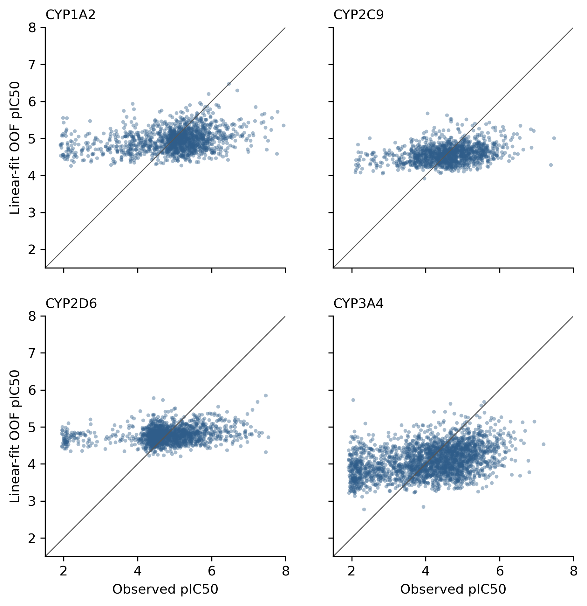

# 002-OADMET-CYP-chemeleon_linear-fit

This submission applies an endpoint-specific linear calibration to predictions from the pretrained [OpenADMET ChEMBL 37 CYP CheMeleon model](https://huggingface.co/openadmet/cyp1a2-cyp2d6-cyp3a4-cyp2c9-chemeleon-v1).  

## Model

**Information Flow Summary**:
```text
challenge SMILES
→ Pretrained OpenADMET CYP-finetuned CheMeleon encoder [frozen]
→ Pretrained native four-output FFN [frozen]
→ Raw pIC50 prediction
→ Linear calibration [fitted on challenge training labels]
→ Final calibrated pIC50
```

**Training Details**:

* **Base Model**: [Pretrained OpenADMET model](https://huggingface.co/openadmet/cyp1a2-cyp2d6-cyp3a4-cyp2c9-chemeleon-v1) `openadmet/cyp1a2-cyp2d6-cyp3a4-cyp2c9-chemeleon-v1`, revision `ef24cf941ae21c7d7a64df378a846bd2066eceda`; trained by OpenADMET on ChEMBL 37 CYP pIC50 records.

*  **Calibration Fitting**: For each CYP endpoint `e`, the submitted prediction is rescaled as
  
  $$
  \text{Predicted pIC}_{50} = \text{Slope}_e \times \text{Raw pIC}_{50} + \text{Intercept}_e
  $$

  Slopes and intercepts were fit to the challenge training data using 5-fold scaffold cross-validation (Bemis-Murcko clusters) to measure generalization.  Final submission parameters were fit on all available challenge training labels.

* **Cross-Validation Performance**: Out-of-fold macro ST-RAE* changed from `0.8981` (raw model) to `0.5734` (linear fit model), with consistent gains across all four endpoints.

The final coefficients are:

| Endpoint | Intercept | Slope |
|---|---:|---:|
| CYP1A2 | 1.233 | 0.698 |
| CYP2C9 | 1.293 | 0.617 |
| CYP2D6 | 2.113 | 0.490 |
| CYP3A4 | -0.868 | 0.929 |

(rounded for display)


## Results and Discussion

Raw predictions from the public ChEMBL-trained model exhibited systematic scale and baseline shifts relative to the challenge assay distribution. Fitting a simple linear post-processing step somewhat corrects this assay-level domain shift by adjusting the mean and variance. 

### Performance against training data



Each point is one out-of-fold training prediction.  Compression in all states is clear. 

## Limitations and Observations

- ChEMBL pIC50 records and the challenge assays are not directly comparable.
- OOF validation used exact Bemis–Murcko groups, which are mostly singletons in this dataset.

## Reproduction

Install the [OpenADMET model runtime](https://github.com/OpenADMET/openadmet-models), download the released model directory, then run:

```bash
python submissions/regression/002-OADMET-CYP-chemeleon_linear-fit/reproduce_from_model.py \
  --test-csv data/cyp-challenge-train-test/cyp-challenge-TEST-BLINDED.csv \
  --model-dir /path/to/cyp1a2-cyp2d6-cyp3a4-cyp2c9-chemeleon-v1/anvil_training \
  --coefficients submissions/regression/002-OADMET-CYP-chemeleon_linear-fit/affine_coefficients.csv \
  --output reproduced.csv \
  --accelerator cpu
```

## Full experiment

The [full experiment record](https://github.com/saltzberg/OpenADMET-CYP/blob/main/experiments/20260821_OA-CYP-native-affine-calibration/README.md) contains the preregistered hypothesis, complete OOF predictions, bootstrap results, fold-specific and final coefficients, detailed metrics, source code, tests, verifier, and run manifest. The submission folder keeps only the concise model report, final coefficients, reproduction code, figure, metadata, and submitted CSV.

---

*ST-RAE - **Soft-Threshold Relative Absolute Error**. Error is measured as the distance between the predicted value and the credible interval bound of the fitted dose-response curve; predictions falling anywhere inside the credible interval incur zero error.
